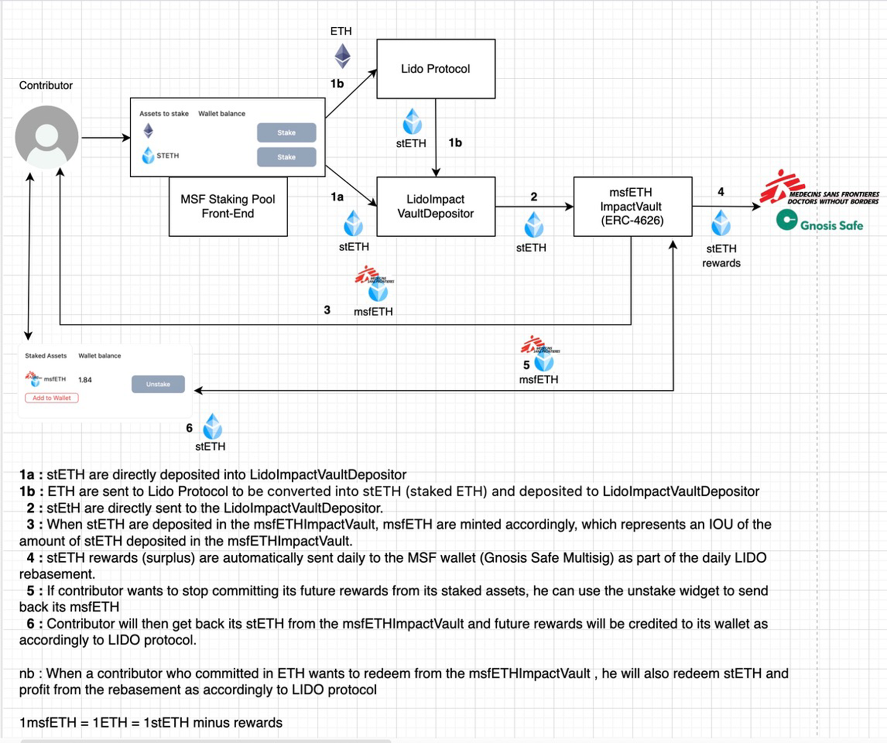

# ImpactVault smart contract - [Arab Bank Switzerland](https://www.arabbank.ch/) Stake2Care Project

## Intro

The ImpactVault smart contract is an ERC 4626 Vault, which is used to donate the revenues of a value-accruing token to a NGO. In the present case, users will deposit Lido ST-ETH and the staking yield will be distributed to Doctors Without Borders (MSF).

On Deposit of stETH, the user receives MSF-ETH. Withdrawals are instantaneous and handled in stETH only.

Deposits into the ImpactVault are further mediated by the LidoImpactVaultDepositor to convert-and-deposit ETH as well. When converting ETH, the user can choose which proportion of the obtained stETH is to be deposited into the Impact Vault while the remainder is sent back to them.




The depositor has the option of staking the obtained msfETH through the charityEscrow contract and receive MSF-Karma rewards. The charityEscrow implements a modified voting-escrow mechanism with several distinct features:

- Upon staking, users receive upfront a bonus in a transferrable ERC-20 token, the "MSF-Karma".
- The Bonus increases quadratically with the time locked.
- Users may unstake before the unlock if they burn MSF-Karma tokens.
- MSF-Karma tokens can be directly purchased from the smart contract.

A precise whitepaper on the charity-escrow logic is available [here](./assets/CharityEscrow.pdf).

## Getting started

- install `npm i`
- build contract using solidity : `npm run build`
- run tests `npm run test`
- deploy `npx hardhat run scripts/deploy.ts --network mainnet`

## Audits
You can find all audit reports under the audits folder:

- [BlackPaper](./audits/25-06-2024_BlackPaper.pdf)
- [HHK](./audits/17-06-2024_HHK.pdf)
- [HHK (CharityEscrow)](./audits/30-01-2025_HHK.pdf)

## Deployment Addresses

Contracts have been deployed to Ethereum Mainnet:

- msfETH (ImpactVault): [0x34f4e4b964a3e648723aE71AF5550FbC85E2e534](https://etherscan.io/address/0x34f4e4b964a3e648723aE71AF5550FbC85E2e534)
- ImpactVaultDepositor: [0x24fA1BaE144Bd97aF2875AE782299B6549726437](https://etherscan.io/address/0x24fA1BaE144Bd97aF2875AE782299B6549726437)
- MSF-Karma: [0x9ec579a11d0d9a866f4910bfeb6234e77a02cd5f](https://etherscan.io/address/0x9ec579a11d0d9a866f4910bfeb6234e77a02cd5f)
- Charity Escrow: [0x0b63AeFCf391122878f5b05CF345b9D1702064c4](https://etherscan.io/address/0x0b63AeFCf391122878f5b05CF345b9D1702064c4)

## Official Website

Stake2Care official [website](https://stake2care.msf.ch/).

## Tests

### Impact Vault
- ✔ Deployer has correct stETH balance at test start and can set stETH accrual
- ✔ Only deployer can set stETH accrual and call the mint function
- ✔ Anyone can submit by sending ETH directly to the stETH contract
- ✔ Deployer has correct msfETH balance at test start
- ✔ Depositor can Mint Asset by sending ETH to `receive()` of `lidoImpactVaultDepositor` and then Withdraw
- ✔ Depositor can Mint Asset by sending stETH via `depositAsset()` function of `lidoImpactVaultDepositor`
- ✔ Depositor can Mint Asset by sending ETH to `depositETH()` of `lidoImpactVaultDepositor` with a depositProportion of 80%
- ✔ `depositToken()` should revert with `NotImplementedError`
- ✔ Only owner can set AutoCollectThreshold
- ✔ Depositor can mint shares by sending ETH via `mint()` of `impactVault` and then withdraw
- ✔ `collectDonations` is timelocked for 3 days after second deposit
- ✔ `collectDonations` does not update pending surplus if it is below autoCollectThreshold
- ✔ `collectDonations` can be called with custom minimalTransfer to bypass minimalCollectAmount

### MSFPoint and CharityEscrow
#### MSFPoint
- ✔ MSFP deployment should set the right name and symbol (1185ms)
- ✔ Only `MINTER_ROLE` could mint (90ms)
- ✔ Only `DEFAULT_ADMIN_ROLE` could `recoverERC20` (88ms)
#### CharityEscrow deployment
- ✔ CharityEscrow deployment should be possible only if `baseEarnRate_` and `yearlyBonus_` below their max value (143ms)
#### Charity escrow usage
- ✔ Only owner could `recoverERC20`, but only if token is different from MSF-STETH
- ✔ Only owner could `setPointPrice`, but only if new price is not too low nor too high, unless if zero (46ms)
- ✔ Only owner could `setEarnStructure`, but only within allowed bounds
- ✔ InvestorA locks his MSF-STETH into CharityEscrow for 3 years
- ✔ View functions `lockReward` and `baseRewardDelta` return expected values
- ✔ `totalSupply` returns ImpactVault Balance
- ✔ The `transfer`, `transferFrom` and `approve` functions exist for CharityEscrow but are not implemented
- ✔ user can buy Points at `pointPrice` (42ms)
- ✔ user cannot buy Points when `pointPrice` is 0
- ✔ InvestorA can unlock his MSF-STETH after the end of the lock period (46ms)
- ✔ InvestorA can `increaseLock` with additional funds and duration
- ✔ InvestorA can `increaseLock` with just additional funds (42ms)
- ✔ InvestorA can `increaseLock` with just additional duration
- ✔ InvestorA cannot `increaseLock` if `newEffectiveLockDuration` is `maximumLockDuration` or below `minimumLockDuration`
- ✔ InvestorA can `decreaseLock` by just decreasing duration (38ms)
- ✔ InvestorA can `decreaseLock` by just decreasing amount (43ms)
- ✔ When increasing Lock, due Time Reward stays similar (51ms)
- ✔ `decreaseLock` is equivalent to an `unlock`, after lock duration ends
- ✔ `decreaseLock` does an `unlock`, if `newEffectiveLockDuration` is null if decrease exceeds duration (41ms)
- ✔ `decreaseLock` reduces all `lockedBalance` if `newLockBalance` is null or if decrease exceeds balance
- ✔ `decreaseLock` reverts if new values are below minimums but non-zero

```

·--------------------------------------------------------|---------------------------|--------------|-----------------------------·
|                  Solc version: 0.8.19                  ·  Optimizer enabled: true  ·  Runs: 1000  ·  Block limit: 30000000 gas  │
·························································|···························|··············|······························
|  Methods                                                                                                                        │
·····························|···························|·············|·············|··············|···············|··············
|  Contract                  ·  Method                   ·  Min        ·  Max        ·  Avg         ·  # calls      ·  usd (avg)  │
·····························|···························|·············|·············|··············|···············|··············
|  CharityEscrow             ·  buyPoints                ·          -  ·          -  ·       89850  ·            1  ·          -  │
·····························|···························|·············|·············|··············|···············|··············
|  CharityEscrow             ·  decreaseLock             ·      37924  ·      77438  ·       64182  ·            8  ·          -  │
·····························|···························|·············|·············|··············|···············|··············
|  CharityEscrow             ·  increaseLock             ·      55044  ·     146811  ·      121511  ·           20  ·          -  │
·····························|···························|·············|·············|··············|···············|··············
|  CharityEscrow             ·  recoverERC20             ·          -  ·          -  ·       62807  ·            1  ·          -  │
·····························|···························|·············|·············|··············|···············|··············
|  CharityEscrow             ·  setEarnStructure         ·          -  ·          -  ·       31072  ·            1  ·          -  │
·····························|···························|·············|·············|··············|···············|··············
|  CharityEscrow             ·  setPointPrice            ·      25359  ·      47300  ·       32079  ·            4  ·          -  │
·····························|···························|·············|·············|··············|···············|··············
|  CharityEscrow             ·  transferOwnership        ·      28036  ·      47936  ·       37986  ·            2  ·          -  │
·····························|···························|·············|·············|··············|···············|··············
|  CharityEscrow             ·  unLock                   ·          -  ·          -  ·       54156  ·            1  ·          -  │
·····························|···························|·············|·············|··············|···············|··············
|  ImpactVault               ·  approve                  ·          -  ·          -  ·       46713  ·           13  ·          -  │
·····························|···························|·············|·············|··············|···············|··············
|  ImpactVault               ·  collectDonations         ·          -  ·          -  ·       38088  ·            1  ·          -  │
·····························|···························|·············|·············|··············|···············|··············
|  ImpactVault               ·  deposit                  ·      85825  ·     115249  ·      111188  ·           31  ·          -  │
·····························|···························|·············|·············|··············|···············|··············
|  ImpactVault               ·  mint                     ·      68770  ·      76294  ·       72532  ·            4  ·          -  │
·····························|···························|·············|·············|··············|···············|··············
|  ImpactVault               ·  redeem                   ·          -  ·          -  ·       94719  ·            2  ·          -  │
·····························|···························|·············|·············|··············|···············|··············
|  ImpactVault               ·  setAutoCollectThreshold  ·      47731  ·      47755  ·       47747  ·            6  ·          -  │
·····························|···························|·············|·············|··············|···············|··············
|  ImpactVault               ·  transfer                 ·      46994  ·      47006  ·       47000  ·            2  ·          -  │
·····························|···························|·············|·············|··············|···············|··············
|  ImpactVault               ·  withdraw                 ·          -  ·          -  ·       94785  ·            2  ·          -  │
·····························|···························|·············|·············|··············|···············|··············
|  LidoImpactVaultDepositor  ·  depositAsset             ·          -  ·          -  ·       95510  ·            2  ·          -  │
·····························|···························|·············|·············|··············|···············|··············
|  LidoImpactVaultDepositor  ·  depositETH               ·          -  ·          -  ·      126445  ·            3  ·          -  │
·····························|···························|·············|·············|··············|···············|··············
|  MSFPoint                  ·  approve                  ·      46657  ·      46669  ·       46662  ·            5  ·          -  │
·····························|···························|·············|·············|··············|···············|··············
|  MSFPoint                  ·  grantRole                ·          -  ·          -  ·       51615  ·            3  ·          -  │
·····························|···························|·············|·············|··············|···············|··············
|  MSFPoint                  ·  mint                     ·          -  ·          -  ·       70912  ·            1  ·          -  │
·····························|···························|·············|·············|··············|···············|··············
|  MSFPoint                  ·  recoverERC20             ·          -  ·          -  ·       62775  ·            1  ·          -  │
·····························|···························|·············|·············|··············|···············|··············
|  SmartAccount              ·  executeBatch             ·          -  ·          -  ·       37064  ·            1  ·          -  │
·····························|···························|·············|·············|··············|···············|··············
|  TestStETH                 ·  approve                  ·      46668  ·      46680  ·       46673  ·           35  ·          -  │
·····························|···························|·············|·············|··············|···············|··············
|  TestStETH                 ·  changeAccrual            ·          -  ·          -  ·       28856  ·           16  ·          -  │
·····························|···························|·············|·············|··············|···············|··············
|  TestStETH                 ·  mint                     ·      73003  ·      73027  ·       73020  ·           30  ·          -  │
·····························|···························|·············|·············|··············|···············|··············
|  Deployments                                           ·                                          ·  % of limit   ·             │
·························································|·············|·············|··············|···············|··············
|  CharityEscrow                                         ·    2432401  ·    2432569  ·     2432485  ·        8.1 %  ·          -  │
·························································|·············|·············|··············|···············|··············
|  ImpactVault                                           ·    1977889  ·    1977913  ·     1977912  ·        6.6 %  ·          -  │
·························································|·············|·············|··············|···············|··············
|  LidoImpactVaultDepositor                              ·          -  ·          -  ·      716156  ·        2.4 %  ·          -  │
·························································|·············|·············|··············|···············|··············
|  MSFPoint                                              ·          -  ·          -  ·     1549720  ·        5.2 %  ·          -  │
·························································|·············|·············|··············|···············|··············
|  SmartAccount                                          ·          -  ·          -  ·      525501  ·        1.8 %  ·          -  │
·························································|·············|·············|··············|···············|··············
|  TestStETH                                             ·          -  ·          -  ·     1086007  ·        3.6 %  ·          -  │
·--------------------------------------------------------|-------------|-------------|--------------|---------------|-------------·

  39 passing (4s)
```
### Coverage
```
-------------------------------|----------|----------|----------|----------|----------------|
File                           |  % Stmts | % Branch |  % Funcs |  % Lines |Uncovered Lines |
-------------------------------|----------|----------|----------|----------|----------------|
 src/                          |    91.43 |    89.42 |    83.33 |    91.15 |                |
  CharityEscrow.sol            |      100 |      100 |    90.91 |    98.39 |        198,203 |
  ImpactVault.sol              |      100 |      100 |      100 |      100 |                |
  ImpactVaultDepositor.sol     |    77.78 |      100 |      100 |    77.78 |108,109,110,111 |
  LidoImpactVaultDepositor.sol |      100 |      100 |      100 |      100 |                |
  MSFPoint.sol                 |      100 |      100 |      100 |      100 |                |
  StEth.sol                    |        0 |        0 |        0 |        0 |... 40,44,45,49 |
  testStEth.sol                |       75 |     62.5 |    85.71 |    83.33 |          38,39 |
 src/intf/                     |      100 |      100 |      100 |      100 |                |
  ICharityEscrow.sol           |      100 |      100 |      100 |      100 |                |
  IImpactVault.sol             |      100 |      100 |      100 |      100 |                |
  IImpactVaultDepositor.sol    |      100 |      100 |      100 |      100 |                |
  IMSFPoint.sol                |      100 |      100 |      100 |      100 |                |
 src/test/                     |      100 |       50 |      100 |      100 |                |
  SmartAccount.sol             |      100 |       50 |      100 |      100 |                |
-------------------------------|----------|----------|----------|----------|----------------|
All files                      |    91.67 |    87.96 |    83.87 |     91.3 |                |
-------------------------------|----------|----------|----------|----------|----------------|
```

