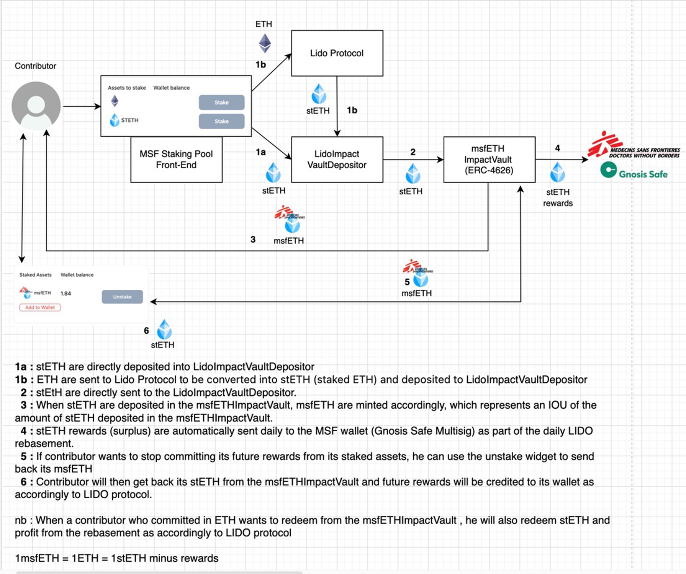

# ImpactVault smart contract - [Arab Bank Switzerland](https://www.arabbank.ch/) Stake2Care Project

## Intro

The ImpactVault smart contract is an ERC 4626 Vault, which is used to donate the revenues of a value-accruing token to a NGO. In the present case, users will deposit Lido ST-ETH and the staking yield will be distributed to Doctors Without Borders (MSF).

On Deposit of stETH, the user receives MSF-ETH. Withdrawals are instantaneous and handled in stETH only.

Deposits into the ImpactVault are further mediated by the LidoImpactVaultDepositor to convert-and-deposit ETH as well. When converting ETH, the user can choose which proportion of the obtained stETH is to be deposited into the Impact Vault while the remainder is sent back to them.




The depositor has the option of staking the obtained msfETH through the charityEscrow contract and receive MSF-Karma rewards. The charityEscrow implements a modified voting-escrow mechanism with several distinct features:

- Upon staking, users receive upfront a bonus in a transferrable ERC-20 token, the "MSF-Karma".
- The Bonus increases quadratically with the time locked.
- Users may unstake before the unlock if they burn MSF-Karma tokens.
- MSF-Karma tokens can be directly purchased from the smart contract.

A precise whitepaper on the charity-escrow logic is available [here](./assets/CharityEscrow.pdf).

### ERC4626 ImpactVault

The system has been generalised to donate the revenues of any value-accruing ERC4626 Vault. FIrst Deployments are Done using mainnet [Morpho Steakhouse SteakHouse USDC](https://app.morpho.org/ethereum/vault/0xBEEF01735c132Ada46AA9aA4c54623cAA92A64CB/steakhouse-usdc) and [Morpho Steakhouse SteakHouse USDT](https://app.morpho.org/ethereum/vault/0xbEef047a543E45807105E51A8BBEFCc5950fcfBa/steakhouse-usdt) as underlyings.


## Getting started

- install `npm i`
- build contract using solidity : `npx hardhat compile`
- run tests `npx hardhat test`
- deploy `npx hardhat run scripts/deploy.ts --network mainnet`

## Audits
You can find all audit reports under the audits folder:

- [BlackPaper](./audits/25-06-2024_BlackPaper.pdf)
- [HHK](./audits/17-06-2024_HHK.pdf)
- [HHK (CharityEscrow)](./audits/30-01-2025_HHK.pdf)
- [HHK (ERC4626 ImpactVault)](./audits/18-01-2026_HHK.pdf)

## Deployment Addresses

Contracts have been deployed to Ethereum Mainnet:

- msfETH (ImpactVault): [0x34f4e4b964a3e648723aE71AF5550FbC85E2e534](https://etherscan.io/address/0x34f4e4b964a3e648723aE71AF5550FbC85E2e534)
- ImpactVaultDepositor: [0x24fA1BaE144Bd97aF2875AE782299B6549726437](https://etherscan.io/address/0x24fA1BaE144Bd97aF2875AE782299B6549726437)
- MSF-Karma: [0x9ec579a11d0d9a866f4910bfeb6234e77a02cd5f](https://etherscan.io/address/0x9ec579a11d0d9a866f4910bfeb6234e77a02cd5f)
- Charity Escrow: [0x0b63AeFCf391122878f5b05CF345b9D1702064c4](https://etherscan.io/address/0x0b63AeFCf391122878f5b05CF345b9D1702064c4)
- MetaMorphoImpactVault USDT: [0x4daE7B08BA283B2ddFC316846cFe247a69EbA097](https://etherscan.io/address/0x4daE7B08BA283B2ddFC316846cFe247a69EbA097)
- MetaMorphoImpactVault USDC: [0x364AB37c89acC82C1F07A26cc3C12185BF858E14](https://etherscan.io/address/0x364AB37c89acC82C1F07A26cc3C12185BF858E14)

## Official Website

Stake2Care official [website](https://stake2care.msf.ch/).

## Tests

### Impact Vault
- ✔ Deployer has correct stETH balance at test start and can set stETH accrual
- ✔ Only deployer can set stETH accrual and call the mint function
- ✔ Anyone can submit by sending ETH directly to the stETH contract
- ✔ Deployer has correct msfETH balance at test start
- ✔ Depositor can Mint Asset by sending ETH to `receive()` of `lidoImpactVaultDepositor` and then Withdraw
- ✔ Depositor can Mint Asset by sending stETH via `depositAsset()` function of `lidoImpactVaultDepositor`
- ✔ Depositor can Mint Asset by sending ETH to `depositETH()` of `lidoImpactVaultDepositor` with a depositProportion of 80%
- ✔ `depositToken()` should revert with `NotImplementedError`
- ✔ Only owner can set AutoCollectThreshold
- ✔ Depositor can mint shares by sending ETH via `mint()` of `impactVault` and then withdraw
- ✔ `collectDonations` is timelocked for 3 days after second deposit
- ✔ `collectDonations` does not update pending surplus if it is below autoCollectThreshold
- ✔ `collectDonations` can be called with custom minimalTransfer to bypass minimalCollectAmount

### MSFPoint and CharityEscrow
#### MSFPoint
- ✔ MSFP deployment should set the right name and symbol (1185ms)
- ✔ Only `MINTER_ROLE` could mint (90ms)
- ✔ Only `DEFAULT_ADMIN_ROLE` could `recoverERC20` (88ms)
#### CharityEscrow deployment
- ✔ CharityEscrow deployment should be possible only if `baseEarnRate_` and `yearlyBonus_` below their max value (143ms)
#### Charity escrow usage
- ✔ Only owner could `recoverERC20`, but only if token is different from MSF-STETH
- ✔ Only owner could `setPointPrice`, but only if new price is not too low nor too high, unless if zero (46ms)
- ✔ Only owner could `setEarnStructure`, but only within allowed bounds
- ✔ InvestorA locks his MSF-STETH into CharityEscrow for 3 years
- ✔ View functions `lockReward` and `baseRewardDelta` return expected values
- ✔ `totalSupply` returns ImpactVault Balance
- ✔ The `transfer`, `transferFrom` and `approve` functions exist for CharityEscrow but are not implemented
- ✔ user can buy Points at `pointPrice` (42ms)
- ✔ user cannot buy Points when `pointPrice` is 0
- ✔ InvestorA can unlock his MSF-STETH after the end of the lock period (46ms)
- ✔ InvestorA can `increaseLock` with additional funds and duration
- ✔ InvestorA can `increaseLock` with just additional funds (42ms)
- ✔ InvestorA can `increaseLock` with just additional duration
- ✔ InvestorA cannot `increaseLock` if `newEffectiveLockDuration` is `maximumLockDuration` or below `minimumLockDuration`
- ✔ InvestorA can `decreaseLock` by just decreasing duration (38ms)
- ✔ InvestorA can `decreaseLock` by just decreasing amount (43ms)
- ✔ When increasing Lock, due Time Reward stays similar (51ms)
- ✔ `decreaseLock` is equivalent to an `unlock`, after lock duration ends
- ✔ `decreaseLock` does an `unlock`, if `newEffectiveLockDuration` is null if decrease exceeds duration (41ms)
- ✔ `decreaseLock` reduces all `lockedBalance` if `newLockBalance` is null or if decrease exceeds balance
- ✔ `decreaseLock` reverts if new values are below minimums but non-zero

#### ERC4626ImpactVault
  #### Deployment
- ✔ Should deploy with correct name and symbol (50ms)
- ✔ Should set correct underlying vault
- ✔ Should set correct asset (same as underlying vault asset)
- ✔ Should approve underlying vault for max uint256
- ✔ Should have correct initial total supply after seeding (100 USDC)
- ✔ Should have correct decimals (6)
- ✔ Should have correct initial totalAssets (100 USDC)
  #### totalAssets
- ✔ Should return underlying vault assets via convertToAssets
- ✔ Should increase by exact yield amount when underlying vault has yield
- ✔ Should decrease by exact loss amount when underlying vault has loss
  #### Deposit
- ✔ Should revert if deposit is below minimum
- ✔ Should mint shares exactly equal to assets when NAV = 1
- ✔ Should transfer exact assets to underlying vault
- ✔ Should emit Deposit event with correct values
- ✔ Should mint more shares when NAV < 1 (after loss)
  #### Mint
- ✔ Should revert if assets needed are below minimum
- ✔ Should mint exact number of shares requested
- ✔ Should take exact assets +1 for shares when NAV = 1
- ✔ Should take fewer assets when NAV < 1
  #### Withdraw
- ✔ Should withdraw exact assets requested (72ms)
- ✔ Should burn exact shares +1 when NAV = 1
- ✔ Should emit Withdraw event with correct values
- ✔ Should burn more shares after loss (NAV < 1)
  #### Redeem
- ✔ Should burn exact shares specified
- ✔ Should give exact assets - 1 when NAV = 1
- ✔ Should give fewer assets when NAV < 1
- ✔ Should give assets = shares - 1 after yield when NAV >= 1 (post donation collection)
  #### Preview Functions
- ✔ previewDeposit should return exact shares for deposit
- ✔ previewMint should return exact assets for mint
- ✔ previewWithdraw should return exact shares for withdraw (82ms)
- ✔ previewRedeem should return exact assets for redeem
- ✔ previewDeposit should match actual deposit exactly
- ✔ previewMint should match actual mint exactly
- ✔ previewWithdraw should match actual withdraw exactly (91ms)
- ✔ previewRedeem should match actual redeem exactly
  #### Max Functions
- ✔ maxDeposit should return underlying vault's maxDeposit
- ✔ maxMint should return shares corresponding to maxDeposit
- ✔ maxWithdraw should return exact redeemable assets for owner (73ms)
- ✔ maxRedeem should return owner's shares
  #### Conversion Functions
- ✔ convertToShares should be exact when NAV = 1
- ✔ convertToAssets should be exact when NAV = 1
- ✔ convertToShares should return more shares when NAV < 1
- ✔ convertToAssets should return fewer assets when NAV < 1
- ✔ convertToShares and convertToAssets should be inverse (within rounding)
  #### collectDonations
- ✔ Should not update timelock if surplus is below minimal transfer threshold
- ✔ Should set timelock on first collection with surplus above threshold
- ✔ Should not transfer during timelock period
- ✔ Should transfer exact surplus to owner after 3-day timelock
- ✔ Should use default minimalCollectAmount when 0 is passed
- ✔ Should trigger collection via deposit when timelock expired
  #### setAutoCollectThreshold
- ✔ Should only be callable by owner
- ✔ Should update minimalCollectAmount to exact value
- ✔ Should emit SetAutoCollectThreshold event with correct values
  #### recoverERC20
- ✔ Should only be callable by owner
- ✔ Should revert when trying to recover underlying vault tokens
- ✔ Should transfer exact amount of other ERC20 tokens to owner
- ✔ Should allow recovering the asset token sent directly
- ✔ Should emit RecoveredERC20 event with correct values
  #### Ownership
- ✔ Should have correct initial owner
- ✔ Should transfer ownership with 2-step process
  #### ERC20 Standard Functions
- ✔ Should have decimals equal to asset decimals
- ✔ Should transfer exact amount between accounts (56ms)
- ✔ Should set exact allowance on approve
- ✔ Should transferFrom and reduce allowance exactly
  ####  Invariants
- ✔ Total supply should equal sum of all balances
- ✔ User cannot withdraw more than maxWithdraw
- ✔ User cannot redeem more than maxRedeem
- ✔ After full redemption, user balance should be exactly zero
- ✔ Vault should never hold assets directly (all goes to underlying)
- ✔ totalAssets should equal underlying vault position exactly
- ✔ collectDonations should preserve user shares exactly
  ####  Edge Cases
- ✔ Should handle deposit when totalSupply is 0 after all redemptions
- ✔ Should track exact balances through multiple deposits and withdrawals
- ✔ Should handle very large deposits correctly
- ✔ Should handle yield followed by loss scenario correctly

###  ERC4626ImpactVault with Underlying Vault Fees
  ####  Impact on Deposit
  - ✔ Should receive fewer underlying shares due to deposit fee (56ms)
  - ✔ Should calculate correct impact vault shares accounting for fee
  - ✔ previewDeposit should match actual deposit with fee
  - ✔ totalAssets should reflect fee impact correctly
  ####  Impact on Mint
  - ✔ Should require more assets to mint due to deposit fee
  - ✔ previewMint should match actual mint with fee

  ####  Impact on Withdraw
  - ✔ Should burn more shares to withdraw due to fee (72ms)
  - ✔ previewWithdraw should match actual withdraw with fee
  - ✔ Should calculate exact shares burned with fee
  ####  Impact on Redeem
  - ✔ Should receive fewer assets when redeeming due to fee
  - ✔ previewRedeem should match actual redeem with fee
  - ✔ Should calculate exact assets received with fee
  - ✔ maxWithdraw should account for withdraw fee
  ####  Underlying Vault with Both Fees
- ✔ Round-trip deposit then full redeem should reflect both fees (65ms)
- ✔ previewDeposit should match actual with both fees
- ✔ previewMint should match actual with both fees
- ✔ previewWithdraw should match actual with both fees (60ms)
- ✔ previewRedeem should match actual with both fees
- ✔ Yield collection should work correctly with fees
- ✔ Multiple users with fees should maintain fairness
  ####  Edge Cases with Fees
- ✔ Should handle very small deposits with deposit fee
- ✔ Should handle maximum fee (99%)
- ✔ Should handle fee change between operations (71ms)
- ✔ Loss scenario with fees should work correctly (88ms)
- ✔ Yield scenario with fees should work correctly (85ms)
  ####  Invariants with Fees
- ✔ totalSupply should equal sum of all balances with fees (65ms)
- ✔ User cannot withdraw more than maxWithdraw with fees
- ✔ User cannot redeem more than maxRedeem with fees
- ✔ Vault should never hold assets directly with fees (72ms)
- ✔ Full redemption should zero balance with fees

```

·--------------------------------------------------------|---------------------------|--------------|-----------------------------·
|                  Solc version: 0.8.19                  ·  Optimizer enabled: true  ·  Runs: 1000  ·  Block limit: 30000000 gas  │
·························································|···························|··············|······························
|  Methods                                                                                                                        │
·····························|···························|·············|·············|··············|···············|··············
|  Contract                  ·  Method                   ·  Min        ·  Max        ·  Avg         ·  # calls      ·  usd (avg)  │
·····························|···························|·············|·············|··············|···············|··············
|  CharityEscrow             ·  buyPoints                ·          -  ·          -  ·       89850  ·            1  ·          -  │
·····························|···························|·············|·············|··············|···············|··············
|  CharityEscrow             ·  decreaseLock             ·      37924  ·      77438  ·       64182  ·            8  ·          -  │
·····························|···························|·············|·············|··············|···············|··············
|  CharityEscrow             ·  increaseLock             ·      55044  ·     146811  ·      121511  ·           20  ·          -  │
·····························|···························|·············|·············|··············|···············|··············
|  CharityEscrow             ·  recoverERC20             ·          -  ·          -  ·       62807  ·            1  ·          -  │
·····························|···························|·············|·············|··············|···············|··············
|  CharityEscrow             ·  setEarnStructure         ·          -  ·          -  ·       31072  ·            1  ·          -  │
·····························|···························|·············|·············|··············|···············|··············
|  CharityEscrow             ·  setPointPrice            ·      25359  ·      47300  ·       32079  ·            4  ·          -  │
·····························|···························|·············|·············|··············|···············|··············
|  CharityEscrow             ·  transferOwnership        ·      28036  ·      47936  ·       37986  ·            2  ·          -  │
·····························|···························|·············|·············|··············|···············|··············
|  CharityEscrow             ·  unLock                   ·          -  ·          -  ·       54156  ·            1  ·          -  │
·····························|···························|·············|·············|··············|···············|··············
|  ImpactVault               ·  approve                  ·          -  ·          -  ·       46713  ·           13  ·          -  │
·····························|···························|·············|·············|··············|···············|··············
|  ImpactVault               ·  collectDonations         ·          -  ·          -  ·       38088  ·            1  ·          -  │
·····························|···························|·············|·············|··············|···············|··············
|  ImpactVault               ·  deposit                  ·      85825  ·     115249  ·      111188  ·           31  ·          -  │
·····························|···························|·············|·············|··············|···············|··············
|  ImpactVault               ·  mint                     ·      68770  ·      76294  ·       72532  ·            4  ·          -  │
·····························|···························|·············|·············|··············|···············|··············
|  ImpactVault               ·  redeem                   ·          -  ·          -  ·       94719  ·            2  ·          -  │
·····························|···························|·············|·············|··············|···············|··············
|  ImpactVault               ·  setAutoCollectThreshold  ·      47731  ·      47755  ·       47747  ·            6  ·          -  │
·····························|···························|·············|·············|··············|···············|··············
|  ImpactVault               ·  transfer                 ·      46994  ·      47006  ·       47000  ·            2  ·          -  │
·····························|···························|·············|·············|··············|···············|··············
|  ImpactVault               ·  withdraw                 ·          -  ·          -  ·       94785  ·            2  ·          -  │
·····························|···························|·············|·············|··············|···············|··············
|  LidoImpactVaultDepositor  ·  depositAsset             ·          -  ·          -  ·       95510  ·            2  ·          -  │
·····························|···························|·············|·············|··············|···············|··············
|  LidoImpactVaultDepositor  ·  depositETH               ·          -  ·          -  ·      126445  ·            3  ·          -  │
·····························|···························|·············|·············|··············|···············|··············
|  MSFPoint                  ·  approve                  ·      46657  ·      46669  ·       46662  ·            5  ·          -  │
·····························|···························|·············|·············|··············|···············|··············
|  MSFPoint                  ·  grantRole                ·          -  ·          -  ·       51615  ·            3  ·          -  │
·····························|···························|·············|·············|··············|···············|··············
|  MSFPoint                  ·  mint                     ·          -  ·          -  ·       70912  ·            1  ·          -  │
·····························|···························|·············|·············|··············|···············|··············
|  MSFPoint                  ·  recoverERC20             ·          -  ·          -  ·       62775  ·            1  ·          -  │
·····························|···························|·············|·············|··············|···············|··············
|  SmartAccount              ·  executeBatch             ·          -  ·          -  ·       37064  ·            1  ·          -  │
·····························|···························|·············|·············|··············|···············|··············
|  TestStETH                 ·  approve                  ·      46668  ·      46680  ·       46673  ·           35  ·          -  │
·····························|···························|·············|·············|··············|···············|··············
|  TestStETH                 ·  changeAccrual            ·          -  ·          -  ·       28856  ·           16  ·          -  │
·····························|···························|·············|·············|··············|···············|··············
|  TestStETH                 ·  mint                     ·      73003  ·      73027  ·       73020  ·           30  ·          -  │
·····························|···························|·············|·············|··············|···············|··············
|  Deployments                                           ·                                          ·  % of limit   ·             │
·························································|·············|·············|··············|···············|··············
|  CharityEscrow                                         ·    2432401  ·    2432569  ·     2432485  ·        8.1 %  ·          -  │
·····························|···························|·············|·············|··············|···············|··············
|  ERC4626ImpactVault        ·  acceptOwnership          ·          -  ·          -  ·       28335  ·            1  ·          -  │
·····························|···························|·············|·············|··············|···············|··············
|  ERC4626ImpactVault        ·  approve                  ·          -  ·          -  ·       46665  ·            2  ·          -  │
·····························|···························|·············|·············|··············|···············|··············
|  ERC4626ImpactVault        ·  collectDonations         ·      44379  ·     102017  ·       69311  ·           17  ·          -  │
·····························|···························|·············|·············|··············|···············|··············
|  ERC4626ImpactVault        ·  deposit                  ·     113745  ·     163050  ·      138796  ·           71  ·          -  │
·····························|···························|·············|·············|··············|···············|··············
|  ERC4626ImpactVault        ·  mint                     ·     131292  ·     155747  ·      139444  ·            3  ·          -  │
·····························|···························|·············|·············|··············|···············|··············
|  ERC4626ImpactVault        ·  recoverERC20             ·      55693  ·      60541  ·       59329  ·            4  ·          -  │
·····························|···························|·············|·············|··············|···············|··············
|  ERC4626ImpactVault        ·  redeem                   ·      98516  ·     127688  ·      109170  ·           13  ·          -  │
·····························|···························|·············|·············|··············|···············|··············
|  ERC4626ImpactVault        ·  setAutoCollectThreshold  ·      47800  ·      47812  ·       47803  ·            4  ·          -  │
·····························|···························|·············|·············|··············|···············|··············
|  ERC4626ImpactVault        ·  transfer                 ·          -  ·          -  ·       34646  ·            1  ·          -  │
·····························|···························|·············|·············|··············|···············|··············
|  ERC4626ImpactVault        ·  transferFrom             ·          -  ·          -  ·       42669  ·            1  ·          -  │
·····························|···························|·············|·············|··············|···············|··············
|  ERC4626ImpactVault        ·  transferOwnership        ·          -  ·          -  ·       47936  ·            1  ·          -  │
·····························|···························|·············|·············|··············|···············|··············
|  ERC4626ImpactVault        ·  withdraw                 ·     103711  ·     128166  ·      115302  ·           13  ·          -  │
·····························|···························|·············|·············|··············|···············|··············
|  ImpactVault                                           ·    1977889  ·    1977913  ·     1977912  ·        6.6 %  ·          -  │
·························································|·············|·············|··············|···············|··············
|  LidoImpactVaultDepositor                              ·          -  ·          -  ·      716156  ·        2.4 %  ·          -  │
·························································|·············|·············|··············|···············|··············
|  MSFPoint                                              ·          -  ·          -  ·     1549720  ·        5.2 %  ·          -  │
·························································|·············|·············|··············|···············|··············
|  SmartAccount                                          ·          -  ·          -  ·      525501  ·        1.8 %  ·          -  │
·························································|·············|·············|··············|···············|··············
|  TestStETH                                             ·          -  ·          -  ·     1086007  ·        3.6 %  ·          -  │
·--------------------------------------------------------|-------------|-------------|--------------|---------------|-------------·

  39 passing (4s)
```
### Coverage
```
-------------------------------|----------|----------|----------|----------|----------------|
File                           |  % Stmts | % Branch |  % Funcs |  % Lines |Uncovered Lines |
-------------------------------|----------|----------|----------|----------|----------------|
 src/                          |    87.95 |    83.78 |    86.81 |    88.19 |                |
  CharityEscrow.sol            |      100 |      100 |    90.91 |    98.39 |        198,203 |
  ERC4626ImpactVault.sol       |    86.67 |     77.5 |      100 |    86.47 |... 202,205,532 |
  ImpactVault.sol              |      100 |      100 |      100 |      100 |                |
  ImpactVaultDepositor.sol     |    77.78 |      100 |      100 |    77.78 |108,109,110,111 |
  LidoImpactVaultDepositor.sol |      100 |      100 |      100 |      100 |                |
  MSFPoint.sol                 |      100 |      100 |      100 |      100 |                |
  MetaMorphoImpactVault.sol    |        0 |        0 |        0 |        0 | 51,52,53,61,62 |
  StEth.sol                    |        0 |        0 |        0 |        0 |... 40,44,45,49 |
  testStEth.sol                |       75 |     62.5 |    85.71 |    83.33 |          38,39 |
 src/intf/                     |      100 |      100 |      100 |      100 |                |
  ICharityEscrow.sol           |      100 |      100 |      100 |      100 |                |
  IERC4626ImpactVault.sol      |      100 |      100 |      100 |      100 |                |
  IImpactVault.sol             |      100 |      100 |      100 |      100 |                |
  IImpactVaultDepositor.sol    |      100 |      100 |      100 |      100 |                |
  IMSFPoint.sol                |      100 |      100 |      100 |      100 |                |
 src/test/                     |      100 |       50 |      100 |      100 |                |
  SmartAccount.sol             |      100 |       50 |      100 |      100 |                |
 src/test/mocks/               |    68.42 |     37.5 |    88.24 |    67.39 |                |
  MockERC20.sol                |      100 |      100 |      100 |      100 |                |
  UnderlyingVaultMock.sol      |    66.67 |     37.5 |    85.71 |    65.12 |... 112,114,115 |
-------------------------------|----------|----------|----------|----------|----------------|
All files                      |    85.57 |    78.57 |    87.27 |    85.99 |                |
-------------------------------|----------|----------|----------|----------|----------------|
```

